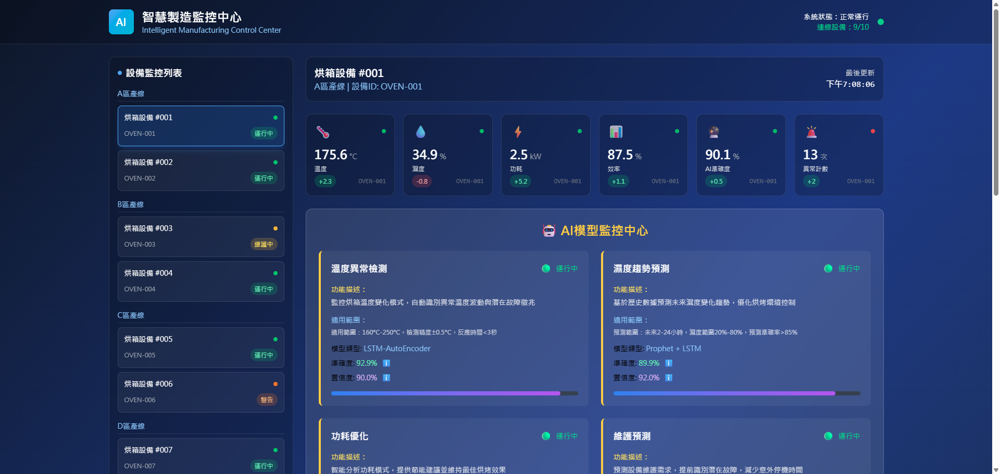

# Smart Oven AI Monitoring System

[](https://smart-oven-monitor.vercel.app/)
[](README.md)
[](README_EN.md)
[](README_JA.md)

| Dashboard Overview | AI Smart Analysis | Device Monitoring |
|:---:|:---:|:---:|
|  |  |  |
| Multi-device real-time monitoring & status management | Six AI analysis panels with intelligent insights | Complete system architecture & professional interface |

## 🔥 Project Overview

An intelligent manufacturing monitoring system that combines AI artificial intelligence and IoT technology for industrial-grade oven monitoring solutions, providing real-time sensor data monitoring, AI anomaly detection, and predictive maintenance recommendations.

🌐 **Live Demo**: [https://smart-oven-monitor.vercel.app/](https://smart-oven-monitor.vercel.app/)

## ✨ Key Features

- 🌡️ **Real-time Sensor Monitoring** - Temperature, humidity, power consumption and other multi-dimensional data display
- 🤖 **AI Intelligent Analysis** - Anomaly prediction, efficiency optimization, maintenance recommendations
- 📊 **Multi-device Monitoring** - Support monitoring up to 10 devices simultaneously
- 💻 **Desktop Application Support** - Native desktop application packaged with Electron
- 🎨 **Professional Interface** - Modern tech-style design
- 📱 **Responsive Design** - Adapts to various screen sizes

## 🏗️ System Architecture

- **Backend**: FastAPI + SQLite + Python
- **Frontend**: React + TypeScript + Vite + TailwindCSS
- **Desktop App**: Electron
- **AI Models**: Anomaly detection + Predictive maintenance algorithms
- **Database**: SQLite (Docker deployment support)

## 🚀 Quick Start

### Method 1: Using Automation Scripts (Recommended)

```bash
# Start the entire system
./start_system.bat

# Stop the system
./stop_system.bat

# Rebuild desktop application
./rebuild_exe.bat
```

### Method 2: Manual Start

#### Backend Service

```bash
cd backend
pip install -r requirements.txt
python main.py
```

Backend will start at `http://localhost:8000`

#### Frontend Application

```bash
cd frontend
npm install
npm run dev
```

Frontend will start at `http://localhost:5173`

#### Desktop Application

```bash
cd frontend
npm run build
npm run electron:build    # Build installer
# or
npm run electron:dev      # Development mode
```

## 🌐 Deployment Options

### Vercel Deployment (Frontend Demo)

Suitable for showcasing frontend functionality with mock data:

1. Fork this project to your GitHub
2. Connect this repository in Vercel
3. Set build directory to `frontend/dist`
4. Automatic deployment complete

### Docker Deployment

```bash
# Build and start all services
docker-compose up -d

# Check running status
docker-compose ps

# Stop services
docker-compose down
```

## 📁 Project Structure

```
OVEN-AI/
├── backend/                 # FastAPI backend
│   ├── main.py             # Main application
│   ├── database.py         # Database configuration
│   ├── requirements.txt    # Python dependencies
│   └── routers/           # API routes
├── frontend/              # React frontend
│   ├── src/              # Source code
│   ├── electron/         # Electron configuration
│   ├── package.json      # Node.js dependencies
│   └── vite.config.ts    # Vite configuration
├── start_system.bat      # System startup script
├── stop_system.bat       # System stop script
├── rebuild_exe.bat       # Desktop app rebuild script
└── README.md            # Project documentation
```

## 🔧 Development Environment Requirements

- **Python**: 3.11+
- **Node.js**: 18+
- **Git**: Latest version
- **Docker**: (Optional) for containerized deployment

## 📊 Feature Showcase

### 🌟 Core Features

- **Multi-device Monitoring**: Support monitoring 10 oven devices simultaneously, including running, maintenance, warning, offline states
- **Real-time Data Display**: Temperature, humidity, power, efficiency and other key parameters update every second
- **Device Status Management**: Different status devices display corresponding color indicators and operation information
- **Intelligent Linked Analysis**: After selecting a device, the right AI analysis panel will update corresponding device data in real-time

### 🤖 AI Intelligent Analysis

- **Anomaly Prediction**: LSTM-AutoEncoder model, 92.5% accuracy
- **Humidity Trend Prediction**: Prophet + LSTM hybrid model, 89.3% accuracy
- **Power Optimization**: Multi-objective optimization algorithm, 94.7% accuracy
- **Maintenance Prediction**: Random Forest + Survival Analysis, 91.2% accuracy

### 🧠 Smart Insights System

Six analysis panels that dynamically adjust based on device status:

1. **Anomaly Prediction** 🔮 - Machine learning-based early warning for equipment anomalies
2. **Efficiency Optimization** ⚡ - Intelligent algorithms analyze energy consumption patterns, provide energy-saving solutions
3. **Maintenance Recommendations** 🔧 - Predictive maintenance technology to formulate optimal maintenance plans
4. **Quality Prediction** 🎯 - Combine environmental parameters to predict product quality performance
5. **Energy Consumption Analysis** 📊 - Monitor and analyze energy consumption, identify energy-saving opportunities
6. **Trend Analysis** 📈 - Long-term equipment operation trends, provide data support for decision-making

### 🎨 Interface Features

- **Color Coding System**: Different risk levels use different color indicators
  - 🔴 Red: Offline, Emergency, High Risk
  - 🟠 Orange: Under Maintenance, High Priority
  - 🟡 Yellow: Medium Risk, Preventive
  - 🟢 Green: Normal, Stable, Low Risk
  - 🔵 Blue: Optimization Suggestions, Enhancement Solutions

- **Professional Tech Style**: Dark background + neon colors, creating industrial monitoring center atmosphere
- **Responsive Design**: Perfect adaptation to desktop, tablet, mobile and other devices

## 🤝 Contributing

1. Fork the project
2. Create feature branch (`git checkout -b feature/AmazingFeature`)
3. Commit changes (`git commit -m 'Add some AmazingFeature'`)
4. Push branch (`git push origin feature/AmazingFeature`)
5. Open Pull Request

## 📄 License

This project is licensed under the MIT License - see [LICENSE](LICENSE) file for details

---

🔥 **Smart Manufacturing Starts with Monitoring** 🔥