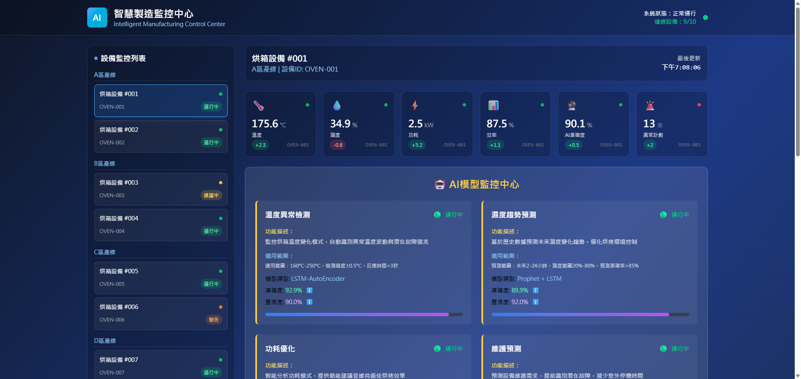
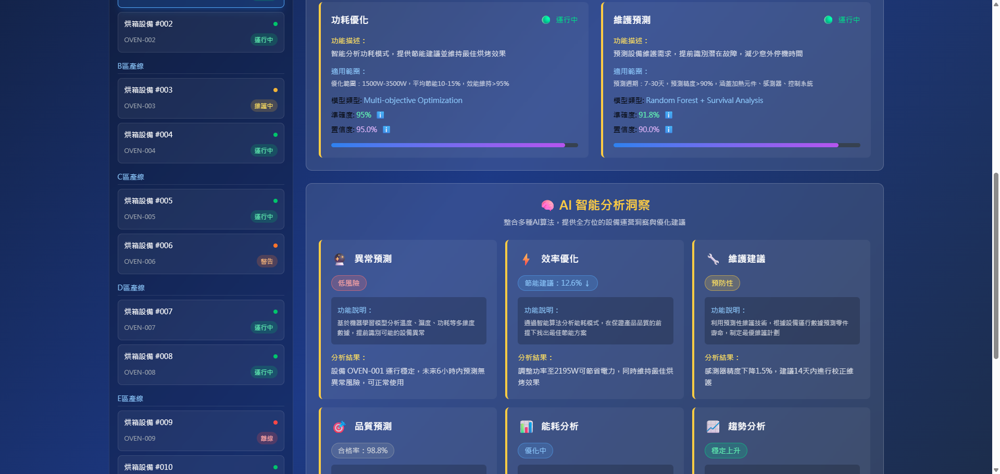
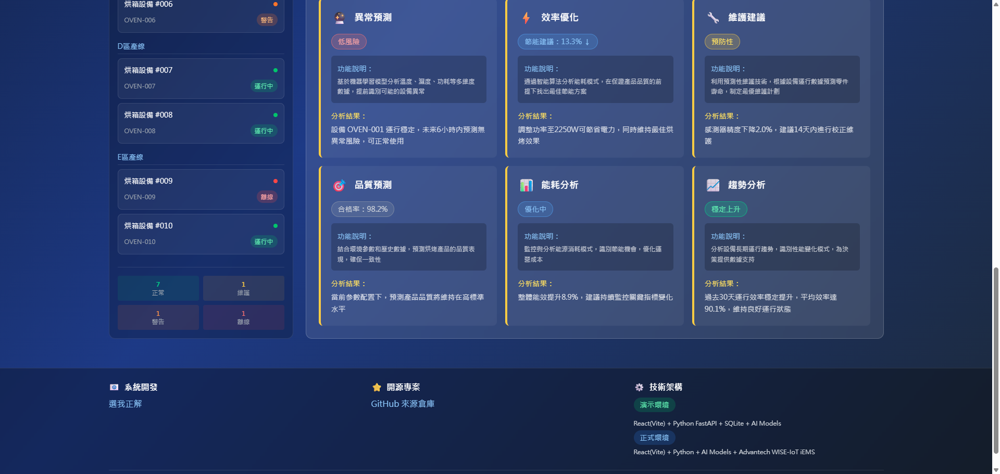

# 智慧烘箱 AI 監控系統

[](https://smart-oven-monitor.vercel.app/)
[](README.md)
[](README_EN.md)
[](README_JA.md)
[](README_ZH-TW.md)

| 儀表板總覽 | AI 智慧分析 | 設備監控 |
|:---:|:---:|:---:|
|  |  |  |
| 多設備即時監控與狀態管理 | 六大 AI 分析面板智慧洞察 | 完整系統架構與專業介面 |

## 🔥 專案概述

智慧製造監控系統 - 結合 AI 人工智慧與 IoT 物聯網技術的工業級烘箱監控解決方案，提供即時感測器數據監控、AI 異常檢測、預測性維護建議等功能。

🌐 **線上展示**: [https://smart-oven-monitor.vercel.app/](https://smart-oven-monitor.vercel.app/)

## ✨ 主要功能

- 🌡️ **即時感測器監控** - 溫度、濕度、功耗等多維度數據即時顯示
- 🤖 **AI 智慧分析** - 異常預測、效率優化、維護建議
- 📊 **多設備監控** - 支援最多 10 台設備同時監控
- 💻 **桌面應用支援** - Electron 打包的原生桌面應用
- 🎨 **專業級介面** - 現代化的科技風格設計
- 📱 **響應式設計** - 適配各種螢幕尺寸

## 🏗️ 系統架構

- **後端**: FastAPI + SQLite + Python
- **前端**: React + TypeScript + Vite + TailwindCSS
- **桌面應用**: Electron
- **AI 模型**: 異常檢測 + 預測性維護演算法
- **資料庫**: SQLite (支援 Docker 部署)

## 🚀 快速開始

### 方法 1: 使用自動化腳本 (推薦)

```bash
# 啟動整個系統
./start_system.bat

# 停止系統
./stop_system.bat

# 重新建立桌面應用
./rebuild_exe.bat
```

### 方法 2: 手動啟動

#### 後端服務

```bash
cd backend
pip install -r requirements.txt
python main.py
```

後端將在 `http://localhost:8000` 啟動

#### 前端應用

```bash
cd frontend
npm install
npm run dev
```

前端將在 `http://localhost:5173` 啟動

#### 桌面應用

```bash
cd frontend
npm run build
npm run electron:build    # 建立安裝檔
# 或
npm run electron:dev      # 開發模式
```

## 🌐 部署選項

### Vercel 部署 (前端 Demo)

適合展示純前端功能，使用模擬數據：

1. Fork 此專案到你的 GitHub
2. 在 Vercel 連接此 repository
3. 設定建置目錄為 `frontend/dist`
4. 自動部署完成

### Docker 部署

```bash
# 建立並啟動所有服務
docker-compose up -d

# 查看運行狀態
docker-compose ps

# 停止服務
docker-compose down
```

## 📁 專案結構

```
OVEN-AI/
├── backend/                 # FastAPI 後端
│   ├── main.py             # 主應用程式
│   ├── database.py         # 資料庫設定
│   ├── requirements.txt    # Python 依賴
│   └── routers/           # API 路由
├── frontend/              # React 前端
│   ├── src/              # 原始碼
│   ├── electron/         # Electron 設定
│   ├── package.json      # Node.js 依賴
│   └── vite.config.ts    # Vite 設定
├── start_system.bat      # 系統啟動腳本
├── stop_system.bat       # 系統停止腳本
├── rebuild_exe.bat       # 桌面應用重建腳本
└── README.md            # 專案說明
```

## 🔧 開發環境需求

- **Python**: 3.11+
- **Node.js**: 18+
- **Git**: 最新版本
- **Docker**: (可選) 用於容器化部署

## 📊 功能展示

### 🌟 核心功能

- **多設備監控**: 支援 10 台烘箱設備同時監控，包含運行、維護、警告、離線等狀態
- **即時數據顯示**: 溫度、濕度、功耗、效率等關鍵參數每秒更新
- **設備狀態管理**: 不同狀態設備顯示對應的顏色標識和運行資訊
- **智能連動分析**: 選擇設備後，右側 AI 分析面板會即時更新對應的設備數據

### 🤖 AI 智能分析

- **異常預測**: LSTM-AutoEncoder 模型，準確度 92.5%
- **濕度趨勢預測**: Prophet + LSTM 混合模型，準確度 89.3%  
- **功耗優化**: 多目標優化算法，準確度 94.7%
- **維護預測**: Random Forest + 生存分析，準確度 91.2%

### 🧠 智慧洞察系統

六大分析面板，根據設備狀態動態調整：

1. **異常預測** 🔮 - 基於機器學習的設備異常提前預警
2. **效率優化** ⚡ - 智能算法分析能耗模式，提供節能方案
3. **維護建議** 🔧 - 預測性維護技術，制定最優維護計劃
4. **品質預測** 🎯 - 結合環境參數預測產品品質表現
5. **能耗分析** 📊 - 監控分析能源消耗，識別節能機會
6. **趨勢分析** 📈 - 設備長期運行趨勢，為決策提供數據支持

### 🎨 界面特色

- **顏色編碼系統**: 不同風險等級使用不同顏色標識
  - 🔴 紅色：離線、緊急、高風險
  - 🟠 橙色：維護中、高優先級
  - 🟡 黃色：中等風險、預防性
  - 🟢 綠色：正常、穩定、低風險
  - 🔵 藍色：優化建議、提升方案

- **專業科技風格**: 深色背景 + 霓虹色彩，營造工業級監控中心氛圍
- **響應式設計**: 完美適配桌面、平板、手機等各種設備

## 🤝 貢獻指南

1. Fork 專案
2. 建立功能分支 (`git checkout -b feature/AmazingFeature`)
3. 提交更改 (`git commit -m 'Add some AmazingFeature'`)
4. 推送分支 (`git push origin feature/AmazingFeature`)
5. 開啟 Pull Request

## 📄 授權條款

本專案採用 MIT 授權條款 - 詳見 [LICENSE](LICENSE) 檔案

---

🔥 **智慧製造，從監控開始** 🔥